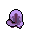
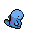

# Pokémon HGSS Animated Overworld Sprites ★

Animated overworld sprites from Pokémon HeartGold & SoulSilver for all four directions.

### *Look at em' go!*

       

---

## Structure

### GIF Format (`GIF/`)

Animated GIF sprites organised by variant:

```
GIF/
├── by-direction/       # Source sprites organised by direction and variant
│   ├── up/
│   │   ├── regular/    # Regular sprites
│   │   └── shiny/      # Shiny variants
│   ├── down/
│   ├── left/
│   └── right/
├── by-pokemon/         # All sprites for each Pokémon
│   └── 001_bulbasaur/
│       ├── regular/
│       └── shiny/
└── by-variant/         # Sprites grouped by variant
    ├── regular/
    ├── shiny/
    ├── female/
    └── forms/
```

### APNG Format (`APNG/`)

Animated PNG sprites with identical structure to `GIF/`:

```
APNG/
├── by-direction/       # Source PNG sprites
├── by-pokemon/         # All sprites for each Pokémon
└── by-variant/         # Sprites grouped by variant
```

---

## What's Included

This is a complete set of animated overworld sprites for Generations 1 through 4 (Pokémon 001-493). Each sprite is a four-frame animation facing up, down, left, or right.

The collection includes:\
★ **[Regular](GIF/by-variant/regular)** sprites for every Pokémon (4 directions) - [APNG](APNG/by-variant/regular) \
★ **[Shiny](GIF/by-variant/shiny)** variants (4 directions) - [APNG](APNG/by-variant/shiny) \
★ **[Female](GIF/by-variant/female)** variants where applicable (4 directions) - [APNG](APNG/by-variant/female) \
★ **[Form](GIF/by-variant/forms)** variations - Unown letters, Castform, Deoxys, Rotom, Giratina, Shaymin, Arceus type forms, etc. - [APNG](APNG/by-variant/forms)

---

## Access Patterns

**By source files**: Browse `GIF/by-direction/{direction}/{variant}/` or `APNG/by-direction/{direction}/{variant}/`

**By Pokémon**: Find all sprites for a specific Pokémon in `GIF/by-pokemon/{number}_{name}/` or `APNG/by-pokemon/{number}_{name}/`

**By variant**: Browse by type in `GIF/by-variant/{regular|shiny|female|forms}/`

---

## Sprite Names and Formats

### Filename Convention (Source Files)

Source files follow the pattern:
```
{number}_{variant}_{direction}.{ext}
```

Examples:\
★ `001_up.gif` - Bulbasaur facing up \
★ `150_shiny_down.gif` - Shiny Mewtwo facing down \
★ `003_female_left.gif` - Female Venusaur facing left \
★ `201-a_right.gif` - Unown A facing right \
★ `479-heat_up.gif` - Heat Rotom facing up

### Manifest Files

★ `manifest-gif.json` - Complete index of all GIF sprites \
★ `manifest-png.json` - Complete index of all PNG sprites

Use these for programmatic access or to build custom views.

---

## Credits

**Original sprite source**: [Veekun's Pokémon Project Downloads](https://veekun.com/dex/downloads)

From Veekun's page:
> You can use anything on this page however you want. Nintendo made these, not me, so I don't claim to own them in any way. If you want to credit me for collecting or ripping them, that's cool; if not, that's cool too. Enjoy.

These four-frame animated GIFs were created by combining static PNG frames from Veekun's HGSS overworld sprite collection using a Python script.

*★ Feel free to use these sprites however you like. Credit is appreciated but not required. Have fun! ★*
