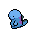

# Pokémon HGSS Animated Overworld Sprites

Animated overworld sprites from Pokémon HeartGold & SoulSilver for all four directions.\
*Look at em' go!*

   
   

---

## What's here

This is a complete set of animated overworld sprites for Generations 1 through 4 (Pokémon 001–493). Each sprite is a four-frame GIF animation facing up, down, left, or right.

The collection includes:\
★ [Regular]() sprites for every Pokémon\
★ [Shiny]() variants\
★ [Female]() variants where applicable\
★ [Form]() variations (Unown, Castform, Deoxys, Rotom, Giratina, Shaymin, Arceus type forms, etc.)\

## How the folders are organised

```
├── down/       # Facing south
├── up/         # Facing north
├── left/       # Facing west
├── right/      # Facing east
└── animation_log.txt  # Generation log
```

Each folder contains about 1,152 sprites.

## Filenames

Sprites follow a straightforward pattern:

```
{number}_{variant}_{direction}.gif
```

Some examples:
- `001_up.gif` ★ Bulbasaur facing up
- `150_shiny_down.gif` ★ Shiny Mewtwo facing down
- `003_female_left.gif` ★ Female Venusaur facing left
- `201-a_right.gif` ★ Unown A facing right
- `479-heat_up.gif` ★ Heat Rotom facing up

## I have no idea if someone has done this already, but...

I made these after searching for animated overworld sprites and only finding downward-facing ones (like on [Bulbapedia](https://archives.bulbagarden.net/w/index.php?title=Category:Overworld_sprites&filefrom=Ani001OD.png#mw-category-media)). I needed all four directions, so I wrote a Python script to combine the static frames from [Veekun's collection](https://veekun.com/dex/downloads) into animated GIFs.

I'm sharing them here in case anyone else runs into the same problem.

## Credits

The original sprites come from [Veekun's Pokémon Project Downloads](https://veekun.com/dex/downloads). From their site:

> You can use anything on this page however you want. Nintendo made these, not me, so I don't claim to own them in any way. If you want to credit me for collecting or ripping them, that's cool; if not, that's cool too. Enjoy.

I'm planning to upload these to [Bulbapedia](https://archives.bulbagarden.net/w/index.php?title=Category:Overworld_sprites) when I have the chance, so they'll be more easily discoverable.

*★ Feel free to use these sprites however you like. Credit is appreciated but not required! ★*

Anyways, have fun!
